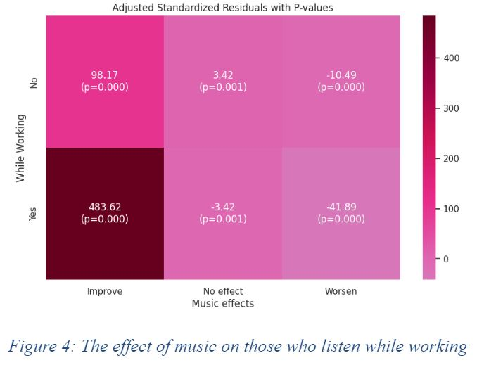

# Understanding Computational Social Science (DS571)

## Overview
This repository contains **lab assignments** and the **Music & Mental Health** project for the **Understanding Computational Social Science (DS571)** course at KAIST. 
There are four lab assignments cover various data science techniques.
And a project that investigates the relationship between music habits and mental health.

## Lab Assignments
The lab assignments explore different aspects of data science, including sentiment analysis, survey sampling, and ethical considerations in research.

- [Lab 1: Trump's Tweets](./Lab_Assignments/Trump's_tweets.pdf)
This assignment investigates the engagement patterns of **Donald Trump’s tweets** using **Latent Dirichlet Allocation (LDA) topic modeling** and **sentiment analysis**. The study examines how different tweet topics and sentiments influence user interaction.

- [Lab 2: Social Media Usage](./Lab_Assignments/Social_Media_Usage.pdf)
Compares results from **non-probability sampling** with **probability sampling** using **social media data**. We analyze biases in data collection and how sample composition affects results.

- [Lab 3: KAIST Students’ Sleep Patterns](./Lab_Assignments/KAIST_students_sleep.pdf)
Explores **sleep behavior among KAIST students** by analyzing how **class start times affect sleeping patterns**. Data was collected through controlled experiments and analyzed using statistical tests.

- [Lab 4: Research Ethics](./Lab_Assignments/research_ethics.pdf)
Discusses **ethical considerations in data science**, including privacy concerns, informed consent, and ethical dilemmas in research using sensitive data.

## Music & Mental Health Project
This project investigates the correlation between **music listening habits, music genres, and mental health conditions** such as anxiety, depression, insomnia, and OCD.

### **Project Details**
- **Analyzes the relationship between music habits and mental health using statistical methods.**
- **Explores the impact of different music genres on mental health severity levels.**
- **Utilizes ANOVA, chi-square tests, regression analysis, and correlation studies.**
- **Dataset contains 736 survey responses with detailed musical preferences and self-reported mental health conditions.**

### 🔗 **Project Files**
**[Detailed README for this project](./Music_Mental_Health/README.md)**  
**Final Report:** [View PDF](./Music_Mental_Health/final_report.pdf)  

### 📈 **Key Findings**
- **Increased music listening hours were associated with higher OCD and insomnia severity.**
- **Listening to music while working was significantly related to higher OCD scores.**
- **Genres like Metal, Rock, and EDM were correlated with higher levels of depression and anxiety.**
- **Listening to foreign language music showed minor effects on depression and anxiety.**

    
    

